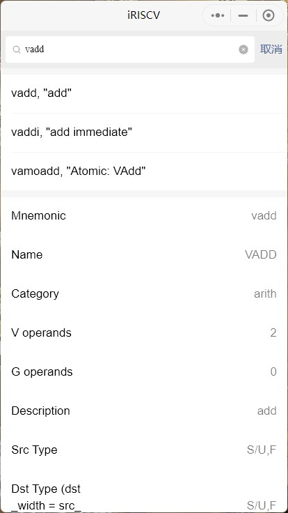

# iRISCV

iRISCV 是一个微信小程序，包含 RISC-V 指令集等信息查询功能。

请打开微信扫一扫，扫描旁边的二维码访问。

## 示例截屏

## 更新

* 2022.6.23
  * Insert `Floating-point`(Patterson and Hennessy, FIGURE 3.17)
* 2022.6.20
  * Insert `Register Conventions` (greencard 20181213, riscv-abi-spec-v0.9): `html`, Integer, Floating-point, Vector
* 2022.6.17
  * Insert `PseudoInstructions` (unprivileged 20191213)
  * [Will be updated!] Insert partial v-extension ISAs (greencard 20191213)
* 2022.6.15
  * Insert `html`：Instruction Formats, Keras available models, activation function, version status (extensions)
* 2022.6.13
  * 上线，包含基础 Integer 指令，Patterson and Hennessy

## 贡献

如果你有需要添加的内容，请整理好后联系我。

## 联系

请在 [issues](https://github.com/xlindo/iRISCV/issues) 与我交谈。
